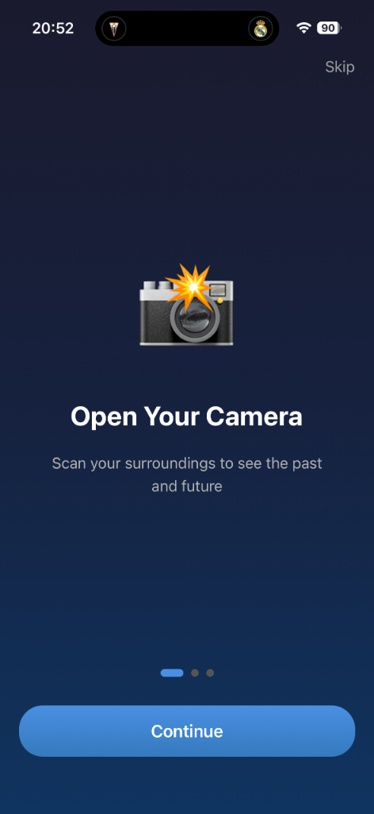
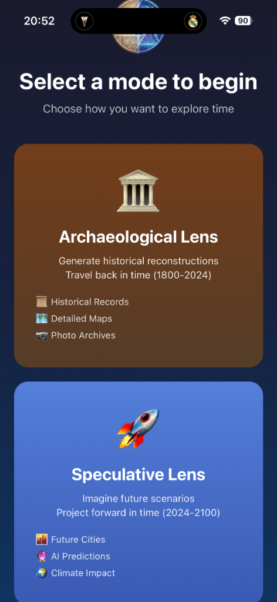
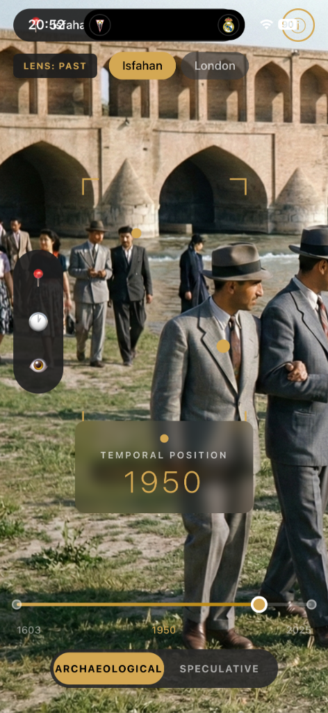

<div align="center">

# 🕰️ Chronoscape

**Travel Through Time with Augmented Reality**

Experience history and future like never before. Point your camera at iconic locations and watch them transform across centuries.

[](https://reactnative.dev/)
[](https://expo.dev/)
[](https://www.typescriptlang.org/)
[](https://openai.com/)
[](/)

</div>

---

## 📱 Screenshots

<div align="center">
<table>
  <tr>
    <td align="center"><br/><b>Splash Screen</b></td>
    <td align="center"><br/><b>Onboarding</b></td>
    <td align="center"><br/><b>Mode Selection</b></td>
    <td align="center"><br/><b>AR Time Travel</b></td>
  </tr>
</table>
</div>

---

## ✨ Features

### 🏛️ Archaeological Lens
Travel back in time to explore historical reconstructions of famous locations.

- **Time Range:** 1600 - Present
- **Historical Records:** Access detailed information about each era
- **Photo Archives:** View AI-generated historical imagery
- **Detailed Maps:** Explore how locations evolved over centuries

### 🚀 Speculative Lens
Imagine the future and see AI-powered predictions of how locations might evolve.

- **Time Range:** Present - 2100
- **Future Cities:** Visualize urban development
- **AI Predictions:** Advanced scenario modeling
- **Climate Impact:** See potential environmental changes

### 📍 Supported Locations

| Location | Country | Time Periods |
|----------|---------|--------------|
| **Si-o-se-pol Bridge** | Isfahan, Iran | 1600 - 2100 |
| **Tower Bridge** | London, UK | 1600 - 2100 |

*More locations coming soon!*

---

## 🛠️ Tech Stack

| Category | Technology |
|----------|------------|
| **Framework** | React Native with Expo SDK 52 |
| **Language** | TypeScript |
| **AI Integration** | OpenAI GPT-4 Vision & DALL-E 3 |
| **Architecture** | New Architecture (Fabric) enabled |
| **JS Engine** | Hermes |
| **Styling** | React Native StyleSheet |

---

## 🚀 Getting Started

### Prerequisites

- Node.js 18+ 
- npm or yarn
- Xcode 15+ (for iOS)
- Android Studio (for Android)
- OpenAI API Key

### Installation

1. **Clone the repository**
   ```bash
   git clone https://github.com/emreysrs/Chronoscape-App.git
   cd Chronoscape-App
   ```

2. **Install dependencies**
   ```bash
   npm install
   ```

3. **Set up environment variables**
   ```bash
   cp .env.example .env
   ```
   Add your OpenAI API key to the `.env` file:
   ```
   OPENAI_API_KEY=your_api_key_here
   ```

4. **Install iOS dependencies**
   ```bash
   cd ios && pod install && cd ..
   ```

5. **Run the app**
   ```bash
   # iOS
   npm run ios
   
   # Android
   npm run android
   ```

---

## 📁 Project Structure

```
ChronoscapeApp/
├── App.tsx                 # Main application entry
├── components/
│   ├── AdvancedARView.tsx  # AR time travel view
│   ├── ModeSelectionScreen.tsx
│   ├── OnboardingScreen.tsx
│   └── SplashScreen.tsx
├── services/
│   └── aiService.ts        # OpenAI API integration
├── assets/                 # Images and historical photos
├── ios/                    # Native iOS project
├── android/                # Native Android project
└── screenshots/            # App screenshots
```

---

## 🔑 API Configuration

Chronoscape uses OpenAI's API for:

- **GPT-4 Vision:** Analyzes current images and generates historical/future descriptions
- **DALL-E 3:** Creates AI-generated historical and futuristic imagery

To get an API key:
1. Visit [OpenAI Platform](https://platform.openai.com/)
2. Create an account and generate an API key
3. Add it to your `.env` file

---

## 📄 License

This project is licensed under the MIT License - see the [LICENSE](LICENSE) file for details.

---

## 👨‍💻 Author

**Emre Yesilyurt**

- GitHub: [@emreysrs](https://github.com/emreysrs)

---

<div align="center">

**Built with ❤️ using React Native & OpenAI**

*Experience the past. Imagine the future.*

</div>
